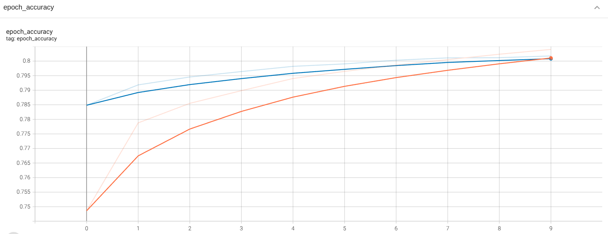
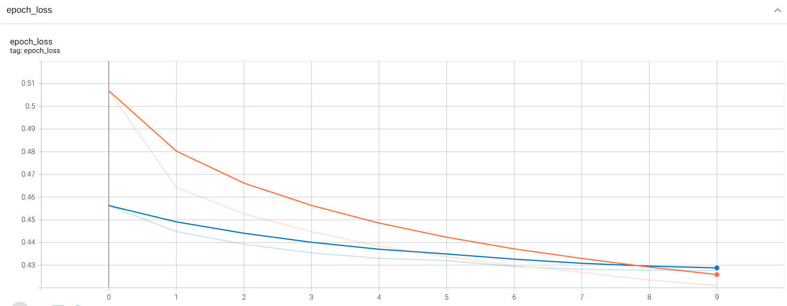
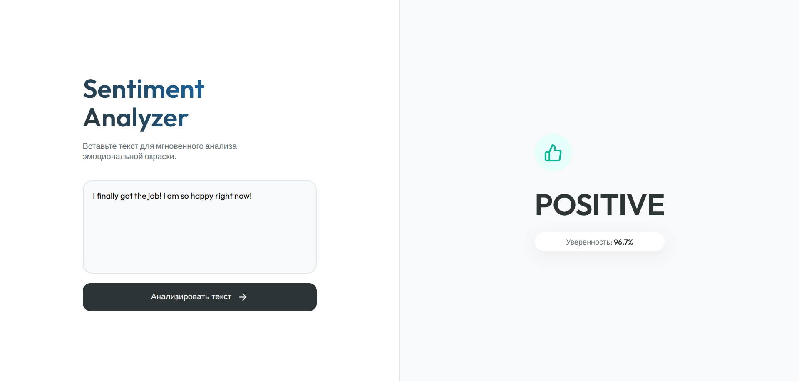
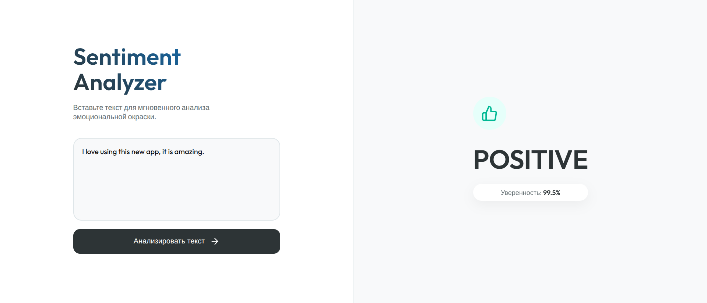
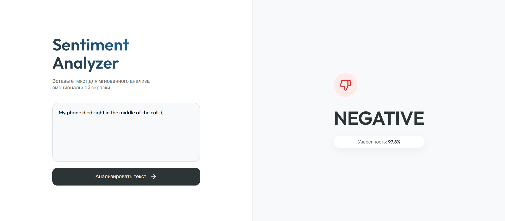
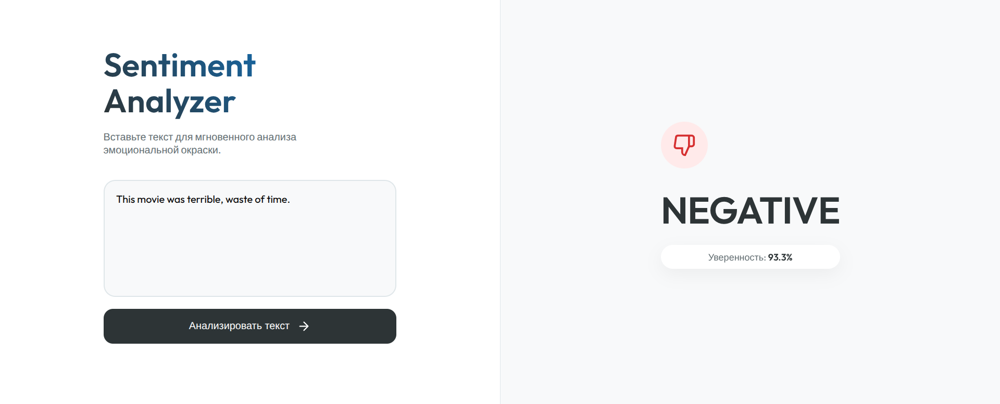

#  Sentiment140 Tweet Analysis

Проект по анализу тональности (Sentiment Analysis) сообщений из Twitter с использованием глубокого обучения (Deep Learning).

Модель разработана для классификации твитов на два класса: Позитивный (Positive) и Негативный (Negative). Решение построено на базе рекуррентных нейронных сетей (GRU) и предобученных векторных представлений слов (GloVe).
## 📊 Результаты

Модель была обучена на **полном датасете Sentiment140**. Данные были разделены на обучающую (80%) и тестовую (20%) выборки для честной оценки качества.

| Метрика | Значение |
| --- | --- |
| **Всего данных** | 1,600,000 твитов |
| **Обучающая выборка** | 1,280,000 твитов |
| **Тестовая выборка** | 320,000 твитов |
| **Test Accuracy** | **80.18%** |
| **Test Loss** | 0.4276 |

### epoch_accuracy:


### epoch_loss:




## 🛠 Технологический стек

* **Язык:** Python 3.6.15
* **Библиотека DL:** TensorFlow / Keras
* **Обработка данных:** Pandas, NumPy, NLTK
* **Архитектура:** Embedding (GloVe) + SpatialDropout1D + Bidirectional GRU + Dense
* **Векторизация:** Pre-trained **GloVe Twitter 27B** embeddings (100d)
* **Web Framework:** Flask
* **Frontend:** HTML CSS

##    Особенности реализации

1.  **Продвинутый препроцессинг:** Очистка текста от URL, упоминаний, спецсимволов, стоп-слов и лемматизация.
2.  **Transfer Learning:** Использование предобученных векторов GloVe, обученных на 2 миллиардах твитов (Twitter-specific embeddings), с последующим Fine-Tuning'ом.
3.  **Стабильность:** Использование Callbacks (EarlyStopping, ModelCheckpoint) для предотвращения переобучения.
4.  **Мониторинг:** Логирование процесса обучения в TensorBoard.
5.  **Готовность к использованию:** Отдельный скрипт `predict.py` для мгновенного анализа любого введенного текста с использованием сохраненной модели.


## Пример работы модели если запускать через predict.py:
Введите твит для анализа: I absolutely love this new framework!
   -> РЕЗУЛЬТАТ: 🟢 ПОЗИТИВНЫЙ (Уверенность: 98.8%)
------------------------------
Введите твит для анализа: The service was terrible and slow.
   -> РЕЗУЛЬТАТ: 🔴 НЕГАТИВНЫЙ (Уверенность: 98.1%)
------------------------------


## Пример работы модели если запускать через app.py:











##  Ссылки:
Sentiment140 Kaggle link:
https://www.kaggle.com/datasets/kazanova/sentiment140

Glove link:
https://github.com/stanfordnlp/GloVe?tab=readme-ov-file
https://nlp.stanford.edu/projects/glove/


.svg)


## 📂 Структура проекта

```text
Sentiment140/
├── data/                  # Исходный датасет и GloVe векторы (не включены в репозиторий из-за размера)
├── images/                # Скрины
├── logs/                  # Логи обучения для TensorBoard
├── saved_models/          # Артефакты модели
│   ├── best_model_glove.h5   # Обученная модель (Keras)
│   └── tokenizer.pickle      # Сохраненный токенизатор
│
├── static/                # 
│   └── style.css          # CSS файл с дизайном
│
├── templates/             # 
│   └── index.html         # HTML страница с разметкой
│
├── app.py                 # Flask
├── main.py                # Скрипт обучения (Training pipeline)
├── model.py               # Архитектура нейросети
├── preprocess.py          # Модуль очистки (используется и в main.py, и в app.py)
├── predict.py             # CLI скрипт для проверки через терминал (опционально)
├── requirements.txt       # Список зависимостей
├── REPORT.md              # Отчет
└── README.md              # Документация


